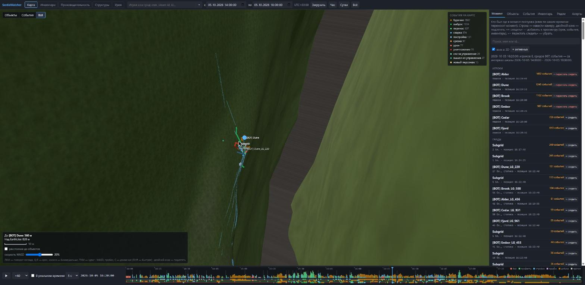
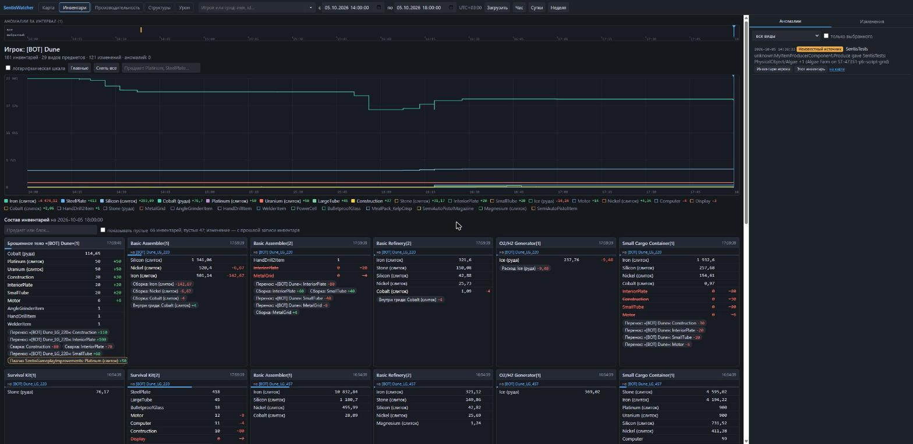
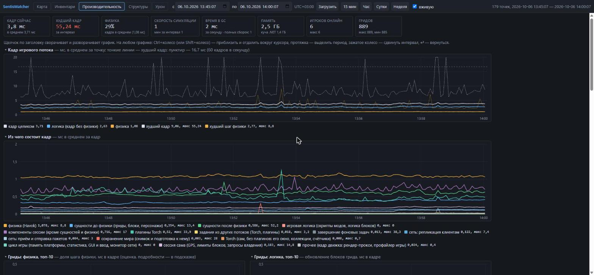
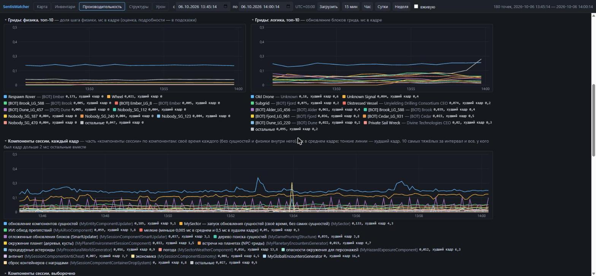
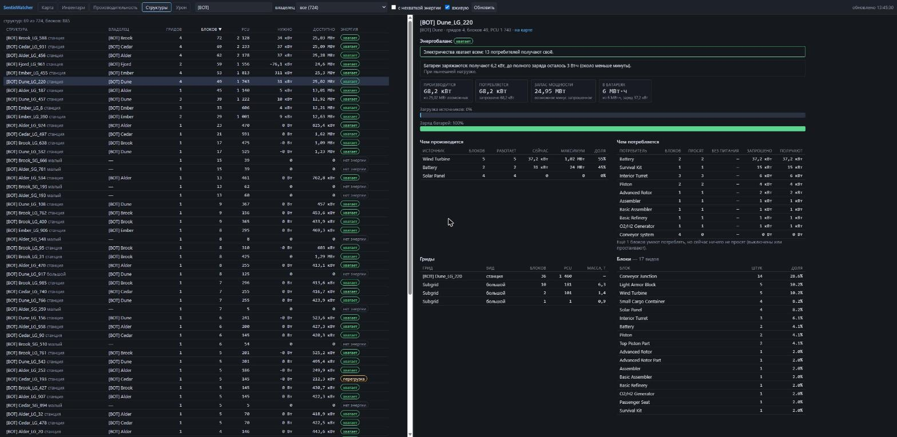
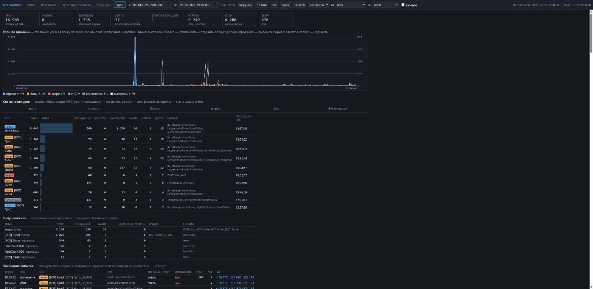

# SentisWatcher

Плагин Torch для Space Engineers: записывает, что происходит на сервере, и показывает это в браузере.

- **Кто где был.** Позиции игроков и гридов, треки на 3D-карте, проигрывание любого момента.
- **Кто что делал.** Урон, срезка, сварка, стройка, бурение, переносы предметов, смена владельцев, вставка гридов,
  прыжки, деньги, чат, вход и выход.
- **Что где лежало.** Содержимое каждого инвентаря по времени и откуда взялось каждое изменение.
- **Поиск дюпа.** Плагин сам отмечает то, чего не бывает при честной игре.
- **Нагрузка сервера.** Из чего состоит кадр, какие гриды, скрипты, моды и плагины его грузят.

Плагин только записывает и показывает: он никого не наказывает и ничего в игре не меняет.

- [Установка](#установка)
- [Страницы](#страницы): [карта](#карта), [инвентари](#инвентари), [производительность](#производительность),
  [структуры](#структуры), [урон](#урон)
- [Аномалии](#аномалии)
- [Команды](#команды)
- [Настройки](#настройки)
- [Доступ из локальной сети](#доступ-из-локальной-сети)
- [Сколько это стоит серверу](#сколько-это-стоит-серверу)
- [Если что-то не так](#если-что-то-не-так)

## Установка

1. Положите в `Plugins` архив `SentisWatcher.zip`.
2. Перезапустите Torch.
3. Откройте на машине сервера `http://127.0.0.1:18950/`.

Запись начинается сама. Данные лежат в `Instance\SentisWatcher`, по файлу на сутки, и хранятся 14 дней.

## Страницы

Вверху каждой страницы - переход между страницами, интервал времени («с» и «по», кнопки «Час», «Сутки») и галочка
«вживую». Время везде по часам сервера. Адрес в строке браузера хранит всё, что вы выбрали: ссылку можно переслать.

Шкалы времени и графики на всех страницах управляются мышью одинаково:
- протяжка выделяет период, кнопка «Показать …» открывает его;
- колесо приближает и отдаляет вокруг курсора (на странице производительности - Ctrl+колесо или Shift+колесо);
- зажатое колесо сдвигает интервал;
- «↩» возвращает прошлый интервал.

### Карта

3D-карта мира: планеты в настоящем масштабе и с настоящим рельефом, игроки и гриды на своих местах.

- **Момент.** Ползунок на шкале внизу выбирает момент; справа - кто где был в этот момент, самые активные сверху.
  Кнопка «▶» проигрывает запись со скоростью от ×1 до ×3600.
- **Слежение.** «+ следить» у игрока или грида добавляет его трек, события и инвентарь. Можно следить за
  несколькими сразу, у каждого свой цвет.
- **События** - цветные точки там, где они произошли: бой, стройка, бурение, переносы. Легенда справа вверху.
  Клик по событию в списке переносит время, двойной клик - подлетает к месту.
- **Шкала времени** показывает активность всего сервера: бой, предметы, стройка, прыжки, добыча. При выборе
  периода камера сама переходит туда, где событий было больше всего.
- **В реальном времени** - галочка внизу: карта идёт за сервером с отставанием в пару секунд, камера следует за
  выбранным объектом.
- **Вкладки справа:** события, инвентарь на выбранный момент, кто был рядом с выбранным объектом, аномалии.

Управление камерой как в игре: левая кнопка мыши - поворот, W, A, S, D - движение, пробел и C - вверх и вниз,
Shift - быстрее, Q и E - крен, колесо - ближе и дальше, двойной клик по объекту - подлететь.

### Инвентари

Что лежало у игрока, на гриде или в блоке и откуда оно взялось.

- **Поиск сверху** - игрок, грид или блок. У игрока показано всё, что ему принадлежит, и то, что на нём.
- **График** - количество каждого предмета по времени. Клик по графику показывает изменения рядом с этим моментом.
- **Откуда изменения.** По каждому предмету: сколько было, сколько стало и из чего сложилась разница -
  переработка, сборка, бурение, перенос с таким-то гридом, выдача плагином или модом. Внешние источники
  подсвечены жёлтым, необъяснённое - красным.
- **Состав инвентарей** на выбранный момент - карточка на каждый инвентарь: что лежит, что изменилось с прошлой
  записи и почему.
- **Аномалии** - полоса вверху и список справа; у каждой кнопки «Инвентари игрока», «Этот инвентарь» и ссылка на
  этот момент на карте.

### Производительность

Как работает сервер и что его грузит.

- **Карточки вверху:** текущий и худший кадр, доля физики, скорость симуляции, время в сборке мусора, память,
  игроки онлайн, число гридов.
- **Кадр игрового потока** - среднее и худший кадр; пунктир - 16,7 мс, выше него сервер не держит 60 кадров.
- **Из чего состоит кадр** - физика, гриды и блоки, моды, плагины, сеть, сохранение.
- **Гриды: физика и логика** - по 10 самых тяжёлых гридов. Физика по гридам - оценка: у движка нет времени
  отдельного грида, поэтому время шага делится по числу активных тел и механических связей.
- **Компоненты сессии** - системы игры и модов по отдельности: сразу видно, какой мод даёт длинные кадры.
- **Скрипты** - каждый программируемый блок с именем, гридом и владельцем.
- **Плагины Torch, сборка мусора, память, скорость симуляции.**
- **Игроки онлайн** - сейчас: фракция, чем управляет, где находится.
- **Кто нагружает игровой поток** - таблица за интервал: игроки, гриды, плагины, моды.

Щелчок по заголовку сворачивает график. В легенде клик скрывает линию, Ctrl+клик оставляет только её.

### Структуры

Мир как он есть сейчас. Структура - гриды с общей электросетью (через роторы, поршни, подвески, коннекторы).

- **Слева** список: владелец, гриды, блоки, PCU, сколько энергии нужно и сколько есть. Поиск по имени, фильтр по
  владельцу, отбор «с нехваткой энергии».
- **Справа** выбранная структура: хватает ли электричества, чем оно производится и чем потребляется, заряд
  батарей, блоки без питания, состав по видам блоков.

### Урон

Кто с кем воюет.

- **Кто наносил урон** и **кому наносили**: попадания, срезка, выстрелы, убитые, разрушенные блоки, оружие.
- **Атакующие** делятся на игроков, ботов, зверей и NPC.
- **Фильтры вверху:** «по врагам» или весь урон; «от» - кто наносил; «по» - кому наносили. Оба фильтра вместе
  показывают, что один игрок сделал другому.
- **Последние события** со ссылкой на это место на карте.

## Аномалии

Плагин отмечает то, чего не бывает при честной игре. Аномалии видны на странице «Инвентари», на карте (вкладка
«Алерты») и по команде `!watch alerts`. Это повод посмотреть записи, а не приговор: плагин ничего не отбирает.

| Аномалия | Что значит |
|---|---|
| Дюп при переносе | После переноса у источника и получателя вместе стало больше предмета, чем было. |
| Изменение в обход учёта | В инвентаре стало больше, чем было плюс всё, что в него пришло. Так выглядит правка модом или плагином. |
| Пропажа | Предмета стало меньше, и никто не видел, как он ушёл. |
| Производство без сырья | Завод или сборщик выдал результат, а сырьё не списалось. |
| Лишнее при подборе или срезке | Подобрано больше, чем лежало; резак получил больше, чем стоит блок. |
| Внешний источник | Предметы выдал мод или скрипт сценария. Выдача плагинами сервера аномалией не считается. |
| Неизвестный источник | Предметы пришли путём, которого плагин не знает. |
| Недопустимое количество | Отрицательное количество или дробное у штучного предмета. |
| Переполнение | В инвентаре или баке больше, чем влезает. |
| Вставка грида игроком | Грид вставил не админ и не в творческом режиме. |

Два уточнения:
- **Дробные количества от сборщика - норма.** Если эффективность сборщика в настройках мира не 1, игра списывает
  дробные части ингредиентов (при эффективности 3 кусок мяса жарится как треть куска). Такое аномалией не
  считается.
- **Одна запись на одно состояние.** Тот же инвентарь с тем же количеством не отмечается заново каждый час и после
  каждого перезапуска.

## Команды

Для админов, в чате. Ответ приходит в чат и целиком сохраняется в `watch-<время>.txt` рядом с данными (в чате
длинный ответ обрезается). В квадратных скобках - необязательное: за сколько минут смотреть и сколько минут назад
это закончилось.

| Команда | Что покажет |
|---|---|
| `!watch status` | Куда пишется, сколько записано, не теряется ли что-нибудь. |
| `!watch player <ник или id> [минут] [назад]` | Где был игрок, что делал он и что делали с ним. |
| `!watch grid <имя или id> [минут] [назад]` | Движение грида, владельцы, кто сколько урона нанёс, срезал, сварил. |
| `!watch near <x> <y> <z> <радиус> [минут] [назад]` | Кто был в этом месте. |
| `!watch inventory <id> [минут] [назад]` | Что лежало в инвентарях блока, персонажа или грида и как менялось. |
| `!watch alerts [минут]` | Найденные аномалии. |
| `!watch load [минут]` | Кто нагружает сервер: игроки, гриды, плагины, моды. |
| `!watch load on` / `off` | Включить или выключить замер нагрузки без перезапуска. |
| `!watch load burst<секунд>[@<мс>]` | Замерять каждый кадр это время: чтобы поймать, из чего сделан редкий долгий кадр. |

## Настройки

Страница плагина в Torch или файл `Instance\SentisWatcher.cfg`.

| Параметр | По умолчанию | Что |
|---|---|---|
| `Enabled` | да | Записывать. |
| `RetentionDays` | 14 | Сколько дней хранить записи. |
| `DatabaseFolder` | пусто | Куда писать; пусто - `Instance\SentisWatcher`. |
| `WebEnabled` | да | Страницы в браузере. |
| `WebPort` | 18950 | Порт страниц. |
| `WebLan` | нет | Открывать страницы из локальной сети, см. ниже. |
| `LoadSampling` | да | Замер нагрузки по гридам, скриптам, модам и плагинам. |
| `DiagnosticLogs` | нет | Подробности работы плагина в логе Torch. Ошибки пишутся всегда. |

## Доступ из локальной сети

По умолчанию страницы открываются только на машине сервера. Чтобы открывать их с других компьютеров сети:

1. Включите `WebLan` («Web view on the network»).
2. Один раз от администратора разрешите Windows слушать порт:
   `netsh http add urlacl url=http://+:18950/ user=<учётная запись, под которой запущен Torch>`
3. Откройте порт в брандмауэре Windows.

Без второго шага плагин остаётся на `127.0.0.1` и пишет в лог команду, которую нужно выполнить.

**У страниц нет пароля**, а на них видны позиции игроков и содержимое инвентарей. Открывайте их только в сети,
которой доверяете, и не выставляйте порт в интернет.

## Сколько это стоит серверу

На стенде со 128 кораблями, 352 тысячами блоков и 64 игроками плагин занимает в среднем 0,05 мс кадра, в худшем
кадре - 0,8 мс. Запись на диск идёт в отдельном потоке и игру не задерживает. Покадровый замер компонентов сессии
стоит ещё 0,03-0,05 мс на кадр; замер нагрузки можно выключить (`LoadSampling` или `!watch load off`).

Если диск не успевает, плагин сначала отбрасывает позиции и только в крайнем случае события; сколько отброшено,
показывает `!watch status`.

## Лицензия

[Apache License 2.0](LICENSE). Код можно использовать, менять и распространять, в том числе в составе своих
плагинов; при этом нужно сохранить текст лицензии и файл [NOTICE](NOTICE) с указанием автора и источника и
отметить, какие файлы изменены. Оба файла лежат и в сборке рядом с dll плагина.
